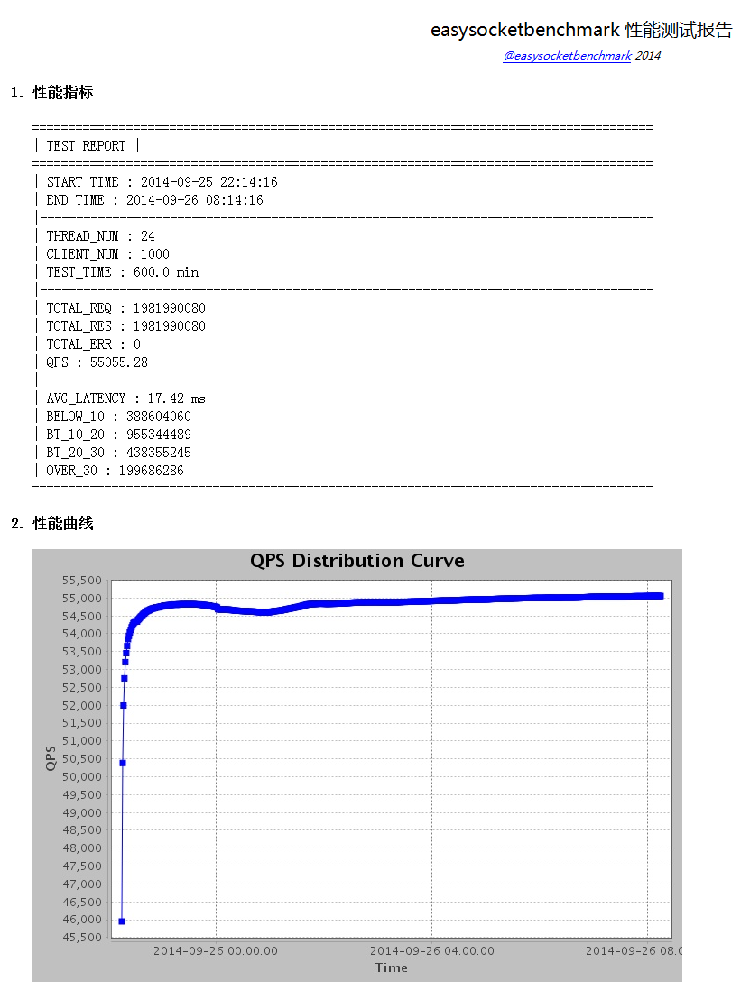

http-benchmark-netty
=============

基于java netty的http客户端工具&amp;http高性能测试工具，web性能测试首选。解决业界web测试工具压力不足、压力不均匀、统计输出不完备、扩展不灵活等所有缺陷。 测试工具参数配置灵活，可满足一般性能测试、延迟测试、最大连接数测试、吞吐量测试、压力测试、长时间稳定性测试、内存泄漏测试等场景。测试工具基于频繁的业务测试不断优化改进，稳定可靠、实用性强。     

### 简介:
* 基于netty异步库开发，one epoll per thread模型，性能强悍。
* 支持随机请求、支持配置线程数、客户端个数、支持压力山大发送模式。
* 支持返回结果验证。
* 支持qps、延迟、最大连接数等统计。
* 支持测试报告邮件自动发送。

### 使用:
* 详见README。
* 测试报告截图：    
     

